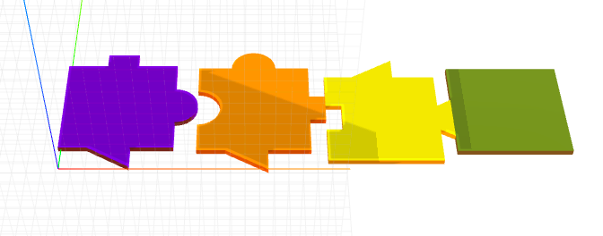

# craft-puzzle

### Install
	$ npm install craft-puzzle

### Parameters
 - side1: connector shape and direction at the bottom
 - side2: connector shape and direction at the left
 - side3: connector shape and direction at the top
 - side4: connector shape and direction at the bottom

## Parameter Format
- [ + | - ][ rectangle | circle | triangle ]
- + makes convex connector
- - makes concave connector hole
- default is none
- Leave it empty if don't want to make connector on side
- More shapes will be updated

## Example
```html
 <craft>
 	<craft name="puzzle" src="./index.xml"/>
	<row>
		<puzzle side1="+triangle" side3="+rectangle" side4="+circle"></puzzle>
		<puzzle side1="+triangle" side2="-circle" side3="+circle" side4="+rectangle"></puzzle>
		<puzzle side2="-rectangle" side3="+triangle" side4="+triangle"></puzzle>
		<puzzle></puzzle>
	</row>	 
</craft>
```


